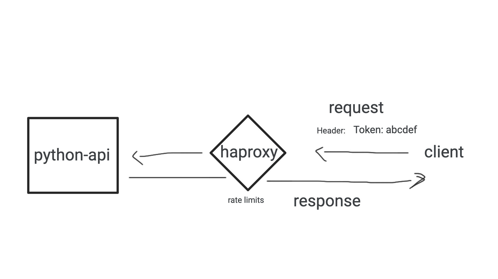

# DevOps Challenge Solution

## Overview

### API and web server

This solution uses a simple Python API built with FastAPI.

### Implementing rate limiting using a proxy server

To implement a rate-limiting mechanism this solution relies on another opensource component, a high availability load balancer and proxy server for TCP and HTTP-based applications, called [haproxy](http://www.haproxy.org/).

To fulfill the two throttling requirements of the challenge, the solution relies on two throttling techniques:

- rate limit by sliding time window
- rate limit by HTTP header

These two techniques have been chosen on the assumption that a client is only able to perform 10 requests per second for every given second in a day and that the user account implementation depends on a specific HTTP header being present (for instance, one that carries an API key or user token).

The **rate limit by sliding time window** is implemented by counting the **total number of requests** `haproxy` has to proxy to the `python-api` and in the case that this number exceeds 10 requests per second, it returns a 429 error as indicated by this configuration line:

`http-request deny deny_status 429 if { sc_http_req_rate(0) gt 10 }`

The **rate limit by HTTP header** mechanism exploits the most common authentication architecture implementation for APIs, basically, carrying an access/user token as a header in the incoming request. By creating a in-memory key value store

`stick-table  type ipv6  size 100k  expire 30s  store http_req_rate(1s)`

haproxy is storying the incoming requests. Then by calculating the requests per user for 1 second, it is able to decide whether it should throttle or forward the next incoming request to the `python-api`.

`use_backend api_slow_down if mark_seen too_many_uploads_by_user`

### Setup

The setup of the solution is straightforward and illustrated in the following diagram.

### Requirements

You need to have the following in your system to run (and evaluate) the solution:

- Docker
- `make`
- `curl`

If you want to develop on `blabla-challenge` you should have `Python3` and `pip3` installed in your system.

### Usage

To build the API application image:

`make build`

Create the network and bring up services:

`docker-compose up`

See the throttling by using the test script:

`./test_throttling.sh`
